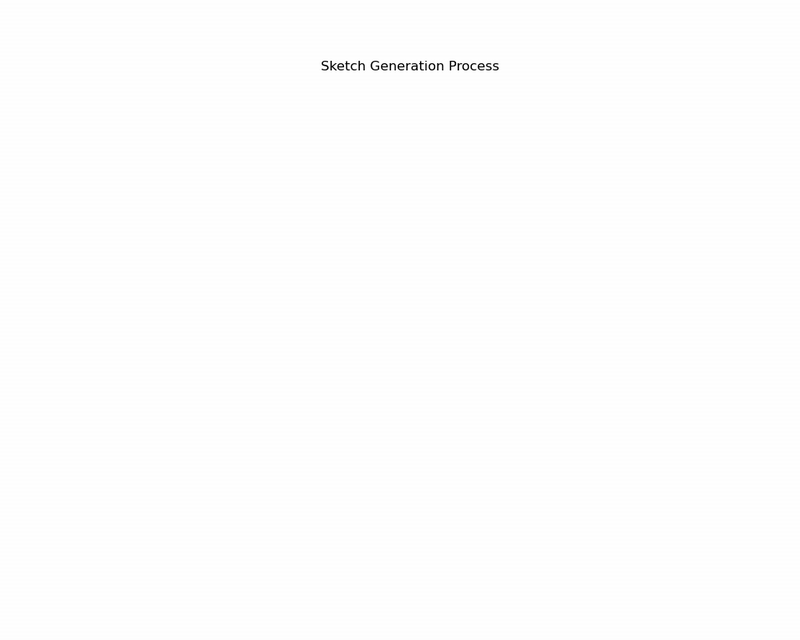

# 🎨 Sequential Sketch Generation with Deep Learning


A deep learning project implementing two powerful approaches to generate human-like sketches **stroke-by-stroke**: Sketch-RNN and Sketch Transformer. Watch AI draw like humans!



## 📋 Project Overview

This project implements deep learning systems that can generate sketch drawings **stroke-by-stroke**, mimicking the human drawing process. Given a class name (e.g., "cat", "airplane", "apple"), the models generate sequences of pen movements that form recognizable sketches.

Each sketch is represented as a sequence of strokes where:

- Each stroke contains **position offsets** (Δx, Δy) representing the movement from the previous position
- Each stroke has a **pen state**: drawing (0), pen lifted (1), or end of sketch (2)

The models learn to predict both the continuous stroke movements and discrete pen states, enabling them to create coherent, recognizable sketches through sequential generation.

## 🧠 Implemented Approaches

### 1. Sketch-RNN Approach


#### Architecture Details

- **Encoder**: Bidirectional GRU that processes the sketch sequence and compresses it into a latent vector
- **Decoder**: Autoregressive GRU that generates new strokes one at a time based on previous strokes
- **Variational Component**: KL-divergence constrained VAE framework to enable diverse generations
- **Output Layer**: Mixture Density Network (MDN) with 20 Gaussian components for probabilistic stroke generation


#### Key Features

- **Sequence Processing**: Treats sketches as temporal sequences of `(Δx, Δy, pen_state)` vectors
- **Probabilistic Generation**: Uses MDN to model multiple possible stroke continuations
- **Hidden State Propagation**: Maintains context through the recurrent hidden state
- **Temperature Control**: Adjustable randomness parameter for generation diversity

```python
class SketchRNN(nn.Module):
    def __init__(self, enc_hidden_size=256, dec_hidden_size=512, z_size=128, dropout=0.5, M=20):
        super(SketchRNN, self).__init__()
        self.encoder = Encoder(enc_hidden_size, z_size, dropout)
        self.decoder = Decoder(dec_hidden_size, z_size, dropout)
        self.gmm = nn.Linear(dec_hidden_size, 6*M+3)  # Parameters for MDN output
```


### 2. Sketch Transformer Approach

<div align="centre">
  
</div>

#### Architecture Details

- **Decoder-Only Transformer**: Modified nanoGPT architecture based on Andrej Karpathy's implementation
- **Stroke Embedding**: Linear projection of 2D strokes into embedding space
- **Pen Embedding**: Embedding layer for the 3 discrete pen states
- **Positional Encoding**: Position-aware embeddings to maintain sequence order
- **Self-Attention Blocks**: 6 layers of multi-head self-attention with 6 heads each


#### Key Innovations

- **Combined Modeling**: Handles both discrete (pen states) and continuous (stroke coordinates) outputs
- **Attention Mechanism**: Captures long-range dependencies in the sketch sequence
- **Mixed Embedding Strategy**: `Embedding(3) + Linear(2→d)` for combining pen states and strokes
- **Causal Masking**: Ensures that generation only depends on previous positions
- **Shared MDN Output Layer**: Like Sketch-RNN, uses mixture density networks for stroke sampling

```python
class SketchTransformer(nn.Module):
    def __init__(self, embd=384, n_heads=6, n_layers=6, dropout=0.2, n_components=20):
        super().__init__()
        # Input embedding layers for strokes and pen states
        self.stroke_emb = nn.Linear(2, embd)
        self.pen_emb = nn.Embedding(3, embd)
        self.pos_emb = nn.Embedding(block_size, embd)
        
        # Transformer blocks
        self.blocks = nn.ModuleList([Block(embd, n_heads, embd_ffn, dropout) for _ in range(n_layers)])
        
        # Output heads
        self.ln_f = nn.LayerNorm(embd)
        self.mdn_head = MDNHead(embd, n_components)
        self.pen_head = nn.Linear(embd, 3)
```


## 📊 Dataset \& Preprocessing

### Quick, Draw! Dataset

This project uses the [Quick, Draw! Dataset](https://github.com/googlecreativelab/quickdraw-dataset) from Google, which contains millions of sketches across 345 categories drawn by players of the "Quick, Draw!" game.

<div align="center">
  
  <br><i>Sample sketches from the Quick, Draw! dataset</i>
</div>

### Dataset Details

- **Size**: 70,000 training, 2,500 validation, and 2,500 test sketches per class
- **Format**: Each sketch is a sequence of `[Δx, Δy, pen_state]` vectors
- **Classes**: Initially trained on "cat" class, but expandable to other categories


### Preprocessing Pipeline

1. **Normalization**:
    - Coordinate normalization to zero mean and unit standard deviation
    - Outlier clipping to handle extreme values
    - Pen state encoding: 0 (drawing), 1 (pen lifted), 2 (end of sketch)
2. **Sequence Processing**:
    - Padding to uniform length (250 strokes maximum)
    - Masking during training to handle variable-length sequences
    - Final pen state explicitly set to 2 (end of sketch)
3. **Data Augmentation**:
    - Random scaling of sketches
    - Random translation within bounds
    - Occasional flipping for increased diversity

## ⚙️ Model Training \& Evaluation

### Training Approach

Both models are trained with similar objectives, though with architecture-specific details:

#### Common Framework

- **Optimizer**: AdamW with learning rate 1e-4
- **Batch Size**: 512 sequences
- **Hardware**: Trained on NVIDIA A4000 GPU (~250 minutes for full training)
- **Early Stopping**: Based on validation loss plateauing


#### Loss Functions

The total loss combines:

1. **Stroke Loss** (L_s): Negative log-likelihood of predicted stroke distributions

```
L_s = -log(∑(π_j * N(Δx_i | μ_j, Σ_j)))
```

2. **Pen State Loss** (L_p): Cross-entropy loss on pen state predictions

```
L_p = -∑(p_i * log(q_i))
```

3. **KL Divergence** (for Sketch-RNN): Constrains the latent space distribution

```
L_KL = 0.5 * η_t * max(KL(q(z|x) || p(z)), KL_min)
```


#### Training Optimizations

- **Gradient Clipping**: Prevents exploding gradients
- **KL Annealing**: Gradually increases the weight of KL divergence term
- **Learning Rate Scheduling**: Step-based decay
- **Temperature Tuning**: Adjusting the randomness during generation


### Evaluation Metrics

- **Reconstruction Loss**: Measures how well the model can reproduce sequences
- **Sample Quality**: Human evaluation of generated sketches
- **Diversity**: Using FID-like metrics to ensure varied generations
- **Interpretability Test**: Determining if humans can recognize generated sketches


## 🎥 Visualization \& Real-Time Demo

### Step-by-Step Generation

Both models generate sketches stroke-by-stroke, producing realistic drawing patterns. The visualization system includes:

1. **SVG Rendering**: Converting stroke sequences to SVG paths

```python
def draw_strokes(data, factor=0.2, svg_filename='sample.svg', color="black", width=1):
    # Convert stroke sequence to SVG path
    dwg = svgwrite.Drawing(svg_filename, size=dims)
    # Create path from strokes...
    return svg_str
```

2. **Animation Capabilities**: Displaying the drawing process in real-time

```python
def visualize_step_by_step(strokes, save_path=None):
    # Create animation frame by frame
    anim = FuncAnimation(fig, update, frames=len(strokes),
                         init_func=init, blit=True, interval=50)
    return anim, HTML(anim.to_jshtml())
```

3. **Interactive Component**: Allows users to provide a partial sketch and let the model complete it

### Generation Control

The system allows fine-tuning of the generation process:

- **Temperature Parameter** (τ): Controls randomness (lower = more deterministic)

```python
# Temperature adjusts the variance in the MDN output
def adjust_temp(pdf, temp=0.6):
    pdf = torch.log(pdf) / temp
    pdf = pdf - torch.max(pdf)
    pdf = torch.exp(pdf)
    return pdf / torch.sum(pdf)
```

- **Sampling Strategy**: Using multinomial sampling for pen states and bivariate Gaussian sampling for strokes
- **Batch Generation**: Creating multiple sketch variations from the same prompt

<div align="center">
  
  <br><i>Multiple cat sketch samples generated with temperature τ=0.4</i>
</div>

## 🚀 Bonus Features

### Interactive Sketch Completion

The models can complete partial sketches drawn by humans:

```python
# Example code for sketch completion
def complete_sketch(initial_strokes, model, n_completions=10, temperature=0.4):
    # Convert user input to model format
    model_input = preprocess_strokes(initial_strokes)
    
    # Generate multiple completions
    completions = []
    for i in range(n_completions):
        # Let model complete the sequence
        completion = model.generate_from_prefix(model_input, temperature=temperature)
        completions.append(completion)
    
    return completions
```


### Multi-Class Generalization

While initially trained on cat sketches, the models can be extended to handle multiple classes:

1. **Class Conditioning**: Adding class embeddings to the models
2. **Joint Training**: Training on multiple classes simultaneously
3. **Class Transfer**: Generating sketches of one class in the style of another

### Physical Drawing Implementation

The project includes support for CNC drawing machines:

```python
def convert_to_gcode(strokes, output_file="drawing.gcode"):
    """Convert stroke sequence to G-code for CNC machines"""
    with open(output_file, 'w') as f:
        f.write("G90\n")  # Absolute positioning
        f.write("G21\n")  # Millimeters
        
        # Initialize position
        x, y = 0, 0
        f.write(f"G0 Z5\n")  # Lift pen
        f.write(f"G0 X{x} Y{y}\n")  # Move to start
        
        # Process strokes
        for dx, dy, pen_state in strokes:
            x += dx * scale_factor
            y += dy * scale_factor
            
            if pen_state == 0:  # Drawing
                f.write(f"G0 Z0\n")  # Lower pen
                f.write(f"G1 X{x} Y{y} F2000\n")  # Draw line
            elif pen_state == 1:  # Pen up
                f.write(f"G0 Z5\n")  # Lift pen
                f.write(f"G0 X{x} Y{y}\n")  # Move without drawing
```


## 💻 Setup \& Usage Instructions

### Installation

```bash
# Clone repository
git clone https://github.com/username/sequential-sketch-generation
cd sequential-sketch-generation

# Install dependencies
pip install torch numpy matplotlib svgwrite ipython
```


### Training Models

```bash
# Train Sketch-RNN model
python train_sketch_rnn.py --batch_size 512 --epochs 100 --lr 1e-4

# Train Sketch Transformer model
python train_transformer.py --embd 384 --n_heads 6 --n_layers 6 --batch_size 512
```


### Generating Sketches

```bash
# Generate sketches with trained models
python generate.py --model_type transformer --class_name cat --n_samples 10 --temperature 0.4

# Interactive completion mode
python interactive.py --model_path models/transformer_cat.pth
```


### Visualization Tools

```bash
# Generate animations of the drawing process
python visualize.py --model_path models/transformer_cat.pth --output_dir animations/
```


## 📚 References \& Resources

### Datasets

- [Quick, Draw! Dataset](https://github.com/googlecreativelab/quickdraw-dataset)
- [TU-Berlin Sketch Dataset](https://cybertron.cg.tu-berlin.de/eitz/projects/classifysketch/)


### Research Papers

- [A Neural Representation of Sketch Drawings (Ha \& Eck, 2017)](https://arxiv.org/abs/1704.03477)
- [Attention is All You Need (Vaswani et al., 2017)](https://arxiv.org/abs/1706.03762)
- [SketchFormer (Ribeiro et al., 2020)](https://arxiv.org/abs/2002.10381)
- [Mixture Density Networks (Bishop, 1994)](https://publications.aston.ac.uk/id/eprint/373/)


### Related Implementations

- [nanoGPT (Karpathy)](https://github.com/karpathy/nanoGPT)
- [SketchRNN TensorFlow Implementation](https://github.com/tensorflow/magenta/tree/master/magenta/models/sketch_rnn)


### Tutorials

- [Mixture Density Networks Tutorial by David Ha](https://github.com/hardmaru/pytorch_notebooks/blob/master/mixture_density_networks.ipynb)
- [The Unreasonable Effectiveness of Recurrent Neural Networks](http://karpathy.github.io/2015/05/21/rnn-effectiveness/)

---


## 🔮 Future Work

- Train on the full 345-class Quick, Draw! dataset
- Explore one-line art style drawing generation
- Implement user-guided sketch refinement
- Create an interactive web demo using TensorFlow.js
- Investigate hybrid VQ-VAE + Transformer approaches

---


<div style="text-align: center">⁂</div>

[^1]: https://ppl-ai-file-upload.s3.amazonaws.com/web/direct-files/30934921/679cde55-7958-4fea-b753-98c63bd9b711/extracted_markdown.md

[^2]: https://ppl-ai-file-upload.s3.amazonaws.com/web/direct-files/30934921/1a0dde84-b3d1-48cc-9561-687c5669540c/sketch_rnn_single.py

[^3]: https://ppl-ai-file-upload.s3.amazonaws.com/web/direct-files/30934921/fbc0916e-1b29-4797-99d3-3ccec1213ebe/transformer_sketch_generation.py

